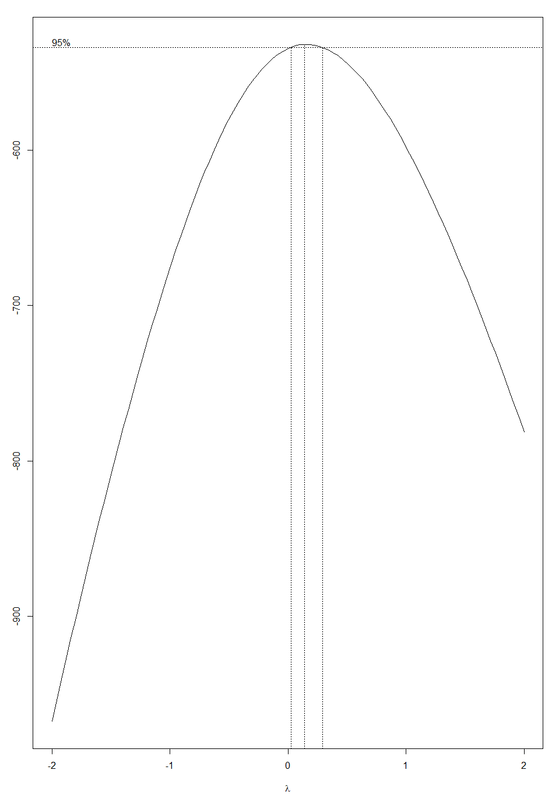

# Boston Housing Market Analysis
## Overview
This repository contains a detailed analysis of the Boston Housing market using multiple linear regression. The analysis was conducted using a comprehensive R script and is documented in a detailed 90-page report. The goal of this project is to understand the factors that affect housing prices and to predict housing values based on various predictor variables.

## Files
Boston_Housing_Analysis.R: This R script contains all the codes for conducting the multiple linear regression analysis.
Boston_Housing_Report.pdf: A detailed report that discusses the methodology, analysis, results, and conclusions.

## Dataset
The dataset used in this analysis is the Boston Housing dataset. Collected by for a study titled ‘Hedonic prices
and the demand for clean air.’ by David Harrison Jr. and Daniel L. Rubinfeld, the data set contains information about the housing values in the suburbs of Boston.

## Objectives
To identify the factors that significantly impact the prices of houses in Boston.
To develop a predictive model for estimating the prices of houses based on their characteristics.

## Methodology
The analysis utilizes multiple linear regression techniques to explore the relationship between house prices and predictor variables such as crime rate, number of rooms, accessibility to highways, etc. The script performs data preprocessing, exploratory data analysis, model building, and validation steps.

## Results
To summarize the report, the finalized MLR model after undergoing a thourough feature selection process can be expressed by the equation:

!(images/final full model.png)

## Optimization
Although the finalized model accounted for nearly 73 percent of the variability in the response variable (the median value of owner occupied homes), a Box-Cox transformation was applied to the model in the hopes of further normalizing the distribution and the residuals of the response data - key assumptions to the validity of the regression model.

The chart below displays the optimal lambda values determined through the Box-Cox transformation, which wass utilized to stabilize variance and normalize the distribution of the dependent variable in the regression model. Each lambda value corresponds to a different variable, indicating the degree of transformation needed to meet the assumptions of linear regression.

As it can be seen, 
