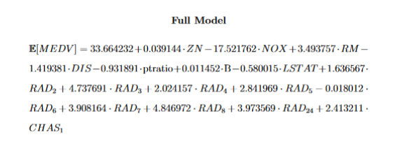
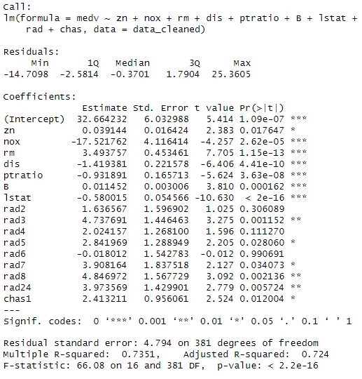
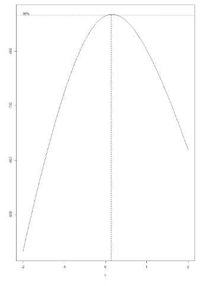
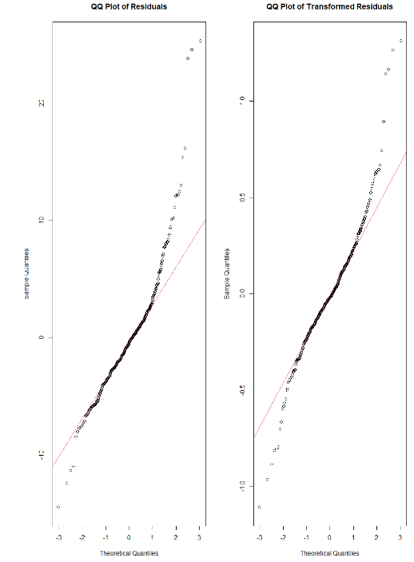
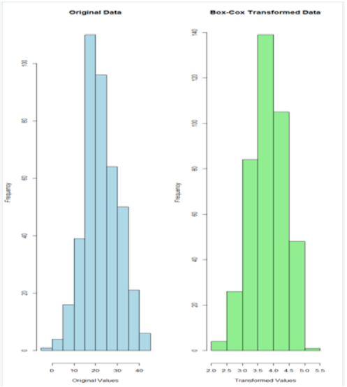
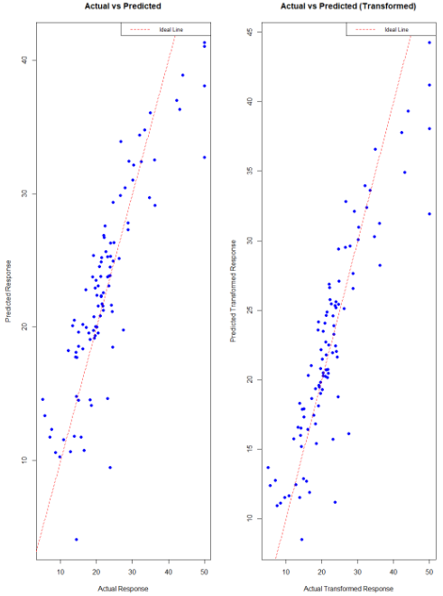
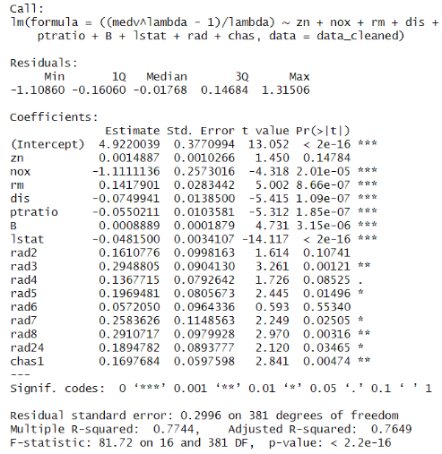
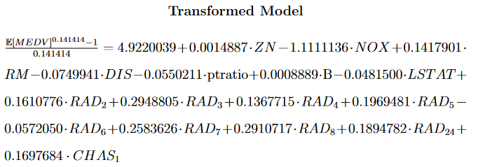

# Boston Housing Market Analysis
## Overview
This repository contains a detailed analysis of the Boston Housing market using multiple linear regression. The analysis was conducted using a comprehensive R script and is documented in a detailed  report. The goal of this project is to understand the factors that affect housing prices and to predict housing values based on various predictor variables.

## Files
Boston_Housing_Analysis.R: This R script contains all the codes for conducting the multiple linear regression analysis.
Boston_Housing_Analysis.pdf: A detailed report that discusses the methodology, analysis, results, and conclusions.

## Dataset
The dataset used in this analysis is the Boston Housing dataset. Collected by for a study titled ‘Hedonic prices and the demand for clean air.’ by David Harrison Jr. and Daniel L. Rubinfeld, the data set contains information about the housing values in the suburbs of Boston.

## Objectives
To identify the factors that significantly impact the prices of houses in Boston and develop a predictive model for estimating the prices of houses based on their characteristics.

## Methodology
The analysis utilizes multiple linear regression techniques to explore the relationship between house prices and predictor variables such as crime rate, number of rooms, accessibility to highways, etc. The script performs data preprocessing, exploratory data analysis, model building, and validation steps.

## Results
To summarize the report, the finalized MLR model after undergoing a thourough feature selection process can be expressed by the equation below. Some basic statistics of this model on unseen test data are provided by the summary() output in R, which can also be seen below.

  

  

The preceding images provides a visual representation of the model's coefficients, and the summary() function in R indicates statistically significant p-values for all of the remaining features left in the model while the R-squared value indicates that approximately 73% of the variance in the median value of owner-occupied homes is explained by this model. These statistics underscore the relevance and effectiveness of the predictor variables and support the interpretations of how these variables influence the median value of owner-occupied homes, which are described below.

* Each additional 25,000 square feet of residential land zoning increases the median home value by $39 on average, assuming other factors are constant.
* A one-unit increase in nitric oxide concentration (per ten million parts) decreases the median home value by approximately $17,520 on average, with other factors held constant.
* Each additional room increases the median home value by an approximate average of $3,494, assuming all other variables remain constant.
* Each unit increase in weighted distance to employment centers decreases the median home value by about $1,419 on average, assuming other factors are constant.
* Each unit increase in the pupil-teacher ratio decreases the median home value by approximately an average of $932, assuming other factors are constant.
* Each one-unit increase in the proportion of African American residents increases the median home value by a mean value of $114, assuming other variables remain constant.
* Each 1% increase in the lower status of the population decreases the median home value by approximately $580 on average, assuming other factors are constant.
* (RAD2 - RAD24): These coefficients represent the incremental differences in median home values associated with varying levels of accessibility to radial highways (RAD values from 2 to 24). Each step up in RAD index typically increases the median home value, with specific increments depending on the RAD level, assuming all other factors are held constant. For example, RAD2 increases the value by an average $1,637, while RAD24 increases it by $3,974 on average.
* Being located adjacent to the Charles River increases the median home value by approximately $2,413 on average compared to homes not adjacent, assuming other variables remain constant.

## Optimization
Having examined the significant impacts of our key predictors, the focus returns to further refining the model. Although the finalized model accounted for nearly 73 percent of the variability in the response variable (the median value of owner occupied homes), a Box-Cox transformation was applied to the model in the hopes of further normalizing the distribution and the residuals of the response data - key assumptions to the validity of the regression model.

The chart below displays the optimal lambda values determined through the Box-Cox transformation, which was utilized to stabilize variance and normalize the distribution of the dependent variable in the regression model. Each lambda value corresponds to a different variable, indicating the degree of transformation needed to meet the assumptions of linear regression.

  

The transformation, with an optimal lambda value of 0.141414, was applied to the regression model to address non-normality of residuals. This transformation adjusts the scale and distribution of the data, aiming to reduce skewness and improve the model's validity.

The effectiveness of this transformation can be visually assessed through the comparison of QQ-plots and histograms before and after applying the Box-Cox transformation. The first image below shows QQ-plots comparing the original and transformed data, highlighting the improved alignment with the normal line, indicative of a more normal distribution. The second image presents histograms of the data before and after transformation, where the smoothing of the distribution curve in the transformed histogram is evident, which also suggests a successful normalization of the data.

  

  

After observing the normalization effects in the QQ plots and histograms, attention can now be turned to the practical implications of the transformations. Next, comparisons the actual versus predicted values for both the transformed and non-transformed models can be seen below to visualize the improvements in accuracy of the transformed model. This comparison, alongside the summary() output of the transformed model, will highlight the enhancements in model performance and accuracy, illustrating the benefits of the Box-Cox transformation efforts.

  

  

The comparison of actual versus predicted values for both the original and transformed models clearly shows a tighter alignment and reduced error in the transformed model's predictions. This improvement is quantitatively supported by the higher R-squared value in the summary() output, which increased from 0.73 in the original model to 0.76 in the transformed model, indicating a better fit to the data.

These enhancements not only validate our transformation approach but also enhance the model's predictive reliability and accuracy. The final figure below visually encapsulates the success of our transformation efforts, presenting a side-by-side view of the transformed versus non-transformed model predictions, which vividly demonstrates the transformation's impact on model performance.

  

This comprehensive analysis and the subsequent transformations have substantially optimized our model, making it a robust tool for predicting the median value of owner-occupied homes in Boston. We conclude our section on transformations here, confident that the modifications have prepared the model well for real-world application and further explorations.

